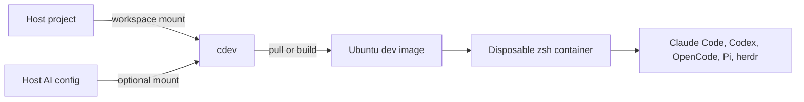

<p align="center"></p>

[](https://github.com/luongnv89/docker-dev/actions)
[](LICENSE)
[](https://github.com/luongnv89/docker-dev/stargazers)

# Start AI coding tools in disposable containers

`cdev` opens your project in a coding-ready Ubuntu container with Claude Code, Codex, OpenCode, Pi, and herdr already installed.

[**Install and start →**](#getting-started)

## Getting Started

Requirements: Docker Desktop or Docker Engine, Git, Bash, and curl.

1. Install `cdev`:

```bash
curl -fsSL https://raw.githubusercontent.com/luongnv89/docker-dev/main/install.sh | bash
```

2. If `cdev` is not found, add its default install directory to `PATH`:

```bash
export PATH="$HOME/.local/bin:$PATH"
```

3. Pull the default image and start a new container for the current project:

```bash
cdev run --pull --workspace "$PWD"
```

4. Inside the container, start an AI coding tool:

```bash
pi
```

Exit the shell to remove the disposable container. Your project remains on the host and is mounted at `/workspace`.

## How It Works



`cdev` selects an image, mounts the workspace, and starts `zsh`. AI credentials stay outside the image and can be mounted from the host.

## Use Existing AI Login State

Mount only the configuration needed by your tool:

| Tool | Start container | Run inside |
|---|---|---|
| Claude Code | `cdev run --pull -w "$PWD" --mount-claude` | `claude` |
| Codex | `cdev run --pull -w "$PWD" --mount-codex` | `codex` |
| OpenCode | `cdev run --pull -w "$PWD" --mount-opencode` | `opencode` |
| Pi | `cdev run --pull -w "$PWD" --mount-pi` | `pi` |
| herdr | `cdev run --pull -w "$PWD"` | `herdr` |

The `ai` preset mounts SSH, Claude, Codex, OpenCode, and Pi configuration together:

```bash
cdev run --preset ai --pull --workspace "$PWD"
```

Use the preset only when `~/.ssh`, `~/.claude`, `~/.codex`, and `~/.config/opencode` exist. A missing `~/.pi` directory is skipped.

## Common Commands

| Goal | Command |
|---|---|
| Show available images | `cdev list` |
| Inspect paths and configuration | `cdev config` |
| Build locally, then start | `cdev run --build -w "$PWD"` |
| Pull the published image, then start | `cdev run --pull -w "$PWD"` |
| Choose Ubuntu 24.04 | `cdev run --pull --image u2404dev -w "$PWD"` |
| Create a named container | `cdev run --pull --name my-dev -w "$PWD"` |
| Re-enter a running named container | `docker exec -it my-dev zsh` |
| Show every run option | `cdev run --help` |

`--build` and `--pull` cannot be used together.

## What Is Included

| Capability | What you get |
|---|---|
| AI tools | Claude Code, Codex, OpenCode, Pi, extensions, and herdr |
| Terminal | zsh, Oh My Zsh, Starship, Vim, fzf, fd, jq |
| Runtimes | Node.js LTS, Corepack, Python, pip, and uv |
| Git workflow | Git, GitHub CLI, and optional read-only SSH mounting |
| Docker workflow | Docker CLI with an opt-in host socket mount |
| Architectures | Published `linux/amd64` and `linux/arm64` images |

## Images and Profiles

### Images

| Image | Base | Python |
|---|---|---|
| `u2604dev` | Ubuntu 26.04 | 3.13 |
| `u2404dev` | Ubuntu 24.04 | 3.12 |
| `u2204dev` | Ubuntu 22.04 | 3.12 |

`u2604dev` is the default. The deprecated `u2604dev-opencode` name resolves to `u2604dev`.

### Profiles

| Profile | GHCR tag | AI tools |
|---|---|---|
| `ai-full` (default) | `latest` | Claude Code, Codex, OpenCode, Pi, extensions, herdr |
| `standard` | `latest-standard` | OpenCode and Pi |
| `minimal` | `latest-minimal` | No global AI tools |

Select a profile when pulling or building:

```bash
cdev run --pull --profile standard --workspace "$PWD"
```

## Authentication and Mounts

Credentials are not stored in the images.

| Flag | Host path | Container path |
|---|---|---|
| `--mount-claude` | `~/.claude` | `/root/.claude` |
| `--mount-codex` | `~/.codex` | `/root/.codex` |
| `--mount-opencode` | `~/.config/opencode` | `/root/.config/opencode` |
| `--mount-pi` | `~/.pi` | `/root/.pi` |
| `--mount-ssh` | `~/.ssh` | `/root/.ssh` read-only |

With `--nonroot`, these paths move under `/home/dev`. Use placeholders in documentation and never commit API keys.

## Docker from Inside the Container

The image contains the Docker client, not a daemon. Mounting the host socket lets the container control the host Docker daemon:

```bash
cdev run --pull --workspace "$PWD" --mount-docker-socket
```

Access to `/var/run/docker.sock` can start privileged containers and mount host paths. Enable it only for trusted projects. The `full` preset enables this mount in addition to all `ai` mounts.

## Documentation

| Topic | File |
|---|---|
| `cdev` reference | [cli/README.md](cli/README.md) |
| Architecture and CI | [docs/architecture.md](docs/architecture.md) |
| Development setup | [docs/development.md](docs/development.md) |
| Troubleshooting | [docs/troubleshooting.md](docs/troubleshooting.md) |
| Contributing | [CONTRIBUTING.md](CONTRIBUTING.md) |
| Security policy | [SECURITY.md](SECURITY.md) |
| Changelog | [CHANGELOG.md](CHANGELOG.md) |

<details>
<summary>Plain Docker commands</summary>

Authenticate to GHCR only if your Docker setup requires it:

```bash
echo "${GH_PAT}" | docker login ghcr.io -u <github-username> --password-stdin
```

Pull the default profile:

```bash
docker pull ghcr.io/luongnv89/u2604dev:latest
```

Start a disposable shell with the current directory mounted:

```bash
docker run --rm -it -v "$PWD":/workspace ghcr.io/luongnv89/u2604dev:latest zsh
```

Pass an API key without storing it in the image:

```bash
docker run --rm -it -e ANTHROPIC_API_KEY="${ANTHROPIC_API_KEY}" -v "$PWD":/workspace ghcr.io/luongnv89/u2604dev:latest zsh
```

Pull a commit-specific image by replacing `<git-sha>`:

```bash
docker pull ghcr.io/luongnv89/u2604dev:<git-sha>
```

</details>

<details>
<summary>Local builds and non-root containers</summary>

Build from the repository root because Dockerfiles copy shared files from `common/`:

```bash
docker build -t my-dev-env -f u2604dev/Dockerfile .
```

Build the minimal profile:

```bash
docker build --build-arg DEV_IMAGE_PROFILE=minimal -t my-dev-env:minimal -f u2604dev/Dockerfile .
```

Run the locally built image:

```bash
docker run --rm -it -v "$PWD":/workspace my-dev-env zsh
```

Containers run as root by default. Build and run as the host UID/GID to avoid root-owned workspace files:

```bash
cdev run --build --nonroot --workspace "$PWD"
```

Published GHCR images remain root-by-default; non-root support requires a local or custom build.

</details>

<details>
<summary>Node and Python environments</summary>

Corepack is enabled for project-managed pnpm and Yarn versions:

```bash
pnpm install
```

```bash
yarn install
```

Create a Python environment with uv:

```bash
uv venv && source .venv/bin/activate
```

Install Python dependencies:

```bash
uv pip install -r requirements.txt
```

Distro `python3`, `pip`, and the `venv` and `activate` shell aliases remain available.

</details>

<details>
<summary>Repository development and CI</summary>

Fork the repository, clone your fork, and create a feature branch:

```bash
git clone https://github.com/YOUR-USERNAME/docker-dev.git
```

```bash
cd docker-dev
```

```bash
git checkout -b my-feature
```

Install the repository pre-commit hook:

```bash
ln -sf ../../scripts/pre-commit.sh .git/hooks/pre-commit
```

Run checks directly:

```bash
./scripts/pre-commit.sh
```

The checks format shell scripts with shfmt, run ShellCheck and Hadolint, build `u2204dev` (`scripts/tasks/test.sh:11`), and remove temporary files. GitHub Actions builds changed images across three profiles, scans with Trivy, and publishes provenance attestations.

To add an image, create `<image-name>/Dockerfile`, add `<image-name>/README.md`, update the image table, and follow [CONTRIBUTING.md](CONTRIBUTING.md#adding-a-new-image).

Validate installation and environment runbooks:

```bash
./scripts/validate-cdev-install.sh --check
```

```bash
./scripts/validate-dev-environment.sh --check
```

</details>

<details>
<summary>Project links and attribution</summary>

- [Issues](https://github.com/luongnv89/docker-dev/issues) — bug reports and feature requests
- [Discussions](https://github.com/luongnv89/docker-dev/discussions) — questions
- [Code of Conduct](CODE_OF_CONDUCT.md)
- Contact: luongnv89@gmail.com
- Shell and editor components: [Oh My Zsh](https://ohmyz.sh/), [Starship](https://starship.rs/), and [Vim](https://www.vim.org/)
- Container runtime: [Docker](https://www.docker.com/)

</details>

<details>
<summary>Previous README</summary>

The complete pre-rewrite README is preserved in [README.backup.md](README.backup.md).

</details>

## Start a Container

```bash
cdev run --pull --workspace "$PWD"
```

[**CLI reference →**](cli/README.md) · [**Troubleshooting →**](docs/troubleshooting.md) · [MIT licensed](LICENSE)
