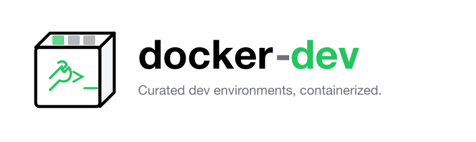

<p align="center"></p>

# docker-dev

[](https://github.com/luongnv89/docker-dev/actions)
[](https://opensource.org/licenses/MIT)
[](https://github.com/luongnv89/docker-dev/stargazers)

Curated Docker images for different development environments. Each image lives in its own directory (e.g., `u2204dev/`) with a dedicated Dockerfile and per-image README describing that environment.

## Features

- **Multi-Platform Support**: Builds for linux/amd64 and linux/arm64 (M-series Macs, ARM servers)
- **Automated CI/CD**: GitHub Actions builds and publishes to GitHub Container Registry
- **Security Scanned**: Images are scanned with Trivy for vulnerabilities
- **Pre-commit Hooks**: Automated formatting, linting, and testing on every commit
- **Production Ready**: Artifact attestation for image provenance
- **Coding-ready images**: git, vim, zsh, Starship, jq, fzf, fd, gh, tzdata (`TZ=Etc/UTC`, overridable), OpenCode, Pi (+ `luongnv89/pi-extensions`), Claude Code & Codex npm CLIs
- **`cdev` CLI**: Interactive launcher with optional workspace, SSH, OpenCode, Pi, `~/.codex`, and `~/.claude` mounts

## Available Images

| Folder | Description | Docs |
|--------|-------------|------|
| `u2604dev/` | Ubuntu 26.04 CLI/dev environment with Oh My Zsh, Starship prompt, Vim plugins, Node.js LTS, Python 3.13, etc. | [u2604dev/README.md](u2604dev/README.md) |
| `u2404dev/` | Ubuntu 24.04 CLI/dev environment with Oh My Zsh, Starship prompt, Vim plugins, Node.js LTS, Python 3.12, etc. | [u2404dev/README.md](u2404dev/README.md) |
| `u2204dev/` | Ubuntu 22.04 CLI/dev environment with Oh My Zsh, wedisagree theme, Vim plugins, Node.js, Python 3.12, etc. | [u2204dev/README.md](u2204dev/README.md) |
| `u2604dev-opencode/` | Thin layer on `u2604dev` for OpenCode-focused workflows | [u2604dev-opencode/README.md](u2604dev-opencode/README.md) |

> As new images are added, follow the same pattern: create `<image-name>/Dockerfile`, add a `<image-name>/README.md`, and update this table.

## Quick Start

### Pull and Run

Authenticate with GitHub Container Registry:
```bash
echo "${GH_PAT}" | docker login ghcr.io -u <your-github-username> --password-stdin
```

Pull an image:
```bash
docker pull ghcr.io/luongnv89/u2604dev:latest
```

Run the container:
```bash
docker run --rm -it ghcr.io/luongnv89/u2604dev:latest zsh
```

### Build Locally

Build a specific image (context is repo root so `common/` scripts are included):
```bash
docker build -t my-dev-env -f u2604dev/Dockerfile .
```

Run locally built image:
```bash
docker run --rm -it -v "$PWD":/workspace my-dev-env zsh
```

### Using the `cdev` CLI (recommended)

**One-line install** — installs **`cdev`** to `~/.local/bin` and clones the images repo to `~/.local/share/docker-dev`. **[herdr](https://herdr.dev/)** is installed inside dev images:
```bash
curl -fsSL https://raw.githubusercontent.com/luongnv89/docker-dev/main/install.sh | bash
```

From a clone:
```bash
./install.sh
```

Ensure `~/.local/bin` is on your `PATH`, then:
```bash
cdev --help
cdev list
cdev run --image u2604dev --workspace "$PWD" --build
```

With host AI config and Git remotes (SSH read-only, OpenCode/Pi when present):
```bash
cdev run --image u2604dev --workspace "$PWD" \
  --mount-ssh --mount-opencode --mount-pi \
  --mount-codex --mount-claude --build
```

From a git clone (without install):
```bash
./cli/bin/cdev --help
```

Inside the container:
```bash
opencode --version
pi --version
```

Mount paths inside the container: `/workspace`, `/root/.ssh` (ro), `/root/.config/opencode`, `/root/.pi`, `/root/.codex`, `/root/.claude`.

Legacy helper: [u2604dev-opencode/run.sh](u2604dev-opencode/run.sh) (prefer `scripts/docker-dev`).

## Documentation

| Topic | File |
|-------|------|
| Contributing guidelines | [CONTRIBUTING.md](CONTRIBUTING.md) |
| Code of conduct | [CODE_OF_CONDUCT.md](CODE_OF_CONDUCT.md) |
| Security policy | [SECURITY.md](SECURITY.md) |
| Changelog | [CHANGELOG.md](CHANGELOG.md) |

## Installation

### Prerequisites

- Docker Desktop or Docker Engine
- (Optional) GitHub PAT for pulling from GHCR

### Getting Images

Images are published to GitHub Container Registry. See [Available Images](#available-images) for the full list.

#### Authentication

Using GitHub PAT (requires read:packages scope):
```bash
echo "${GH_PAT}" | docker login ghcr.io -u <github-username> --password-stdin
```

#### Pulling Images

Pull latest tag:
```bash
docker pull ghcr.io/luongnv89/u2604dev:latest
```

Pull specific version by commit SHA:
```bash
docker pull ghcr.io/luongnv89/u2604dev:<git-sha>
```

#### Running Containers

Interactive shell:
```bash
docker run --rm -it ghcr.io/luongnv89/u2604dev:latest zsh
```

With current directory mounted:
```bash
docker run --rm -it -v "$PWD":/workspace ghcr.io/luongnv89/u2604dev:latest zsh
```

Or use [`cdev run`](#using-the-cdev-cli-recommended) for mounts and optional AI config.

## Development

### Setting Up

1. Fork the repository
2. Clone your fork
3. Create a feature branch

Clone the repository:
```bash
git clone https://github.com/YOUR-USERNAME/docker-dev.git
```

Navigate to the directory:
```bash
cd docker-dev
```

Create a feature branch:
```bash
git checkout -b my-feature
```

### Pre-commit Hooks

Install the pre-commit hook for automated quality checks:
```bash
ln -sf ../../scripts/pre-commit.sh .git/hooks/pre-commit
```

Or run ad-hoc:
```bash
./scripts/pre-commit.sh
```

This will:
- Format shell scripts via shfmt
- Lint shell scripts with ShellCheck
- Lint Dockerfiles with Hadolint
- Build the u2604dev image to verify Dockerfile validity
- Clean up temporary files

### Adding a New Image

See [CONTRIBUTING.md](CONTRIBUTING.md#adding-a-new-image) for detailed instructions.

### CI/CD

The repository uses GitHub Actions for automated builds:

- **Matrix workflow**: Builds all 4 images with multi-platform support
- **Path-based detection**: Only builds images that changed
- **Security scanning**: Trivy scans for vulnerabilities
- **Artifact attestation**: Provenance for published images

Workflow file: [`.github/workflows/build-images.yml`](.github/workflows/build-images.yml)

## Contributing

We welcome contributions! Please read our [Contributing Guide](CONTRIBUTING.md) for:

- Setting up your development environment
- Development workflow
- Pull request process
- Code style guidelines
- Testing requirements

By participating, you are expected to uphold our [Code of Conduct](CODE_OF_CONDUCT.md).

## Security

For security vulnerabilities, please read our [Security Policy](SECURITY.md) for responsible reporting guidelines.

## License

This project is licensed under the MIT License - see the [LICENSE](LICENSE) file for details.

## Acknowledgments

- [Oh My Zsh](https://ohmyz.sh/) for the excellent shell framework
- [Starship](https://starship.rs/) for the cross-shell prompt
- [Vim](https://www.vim.org/) community for editor plugins
- [Docker](https://www.docker.com/) for container technology

## Support

- [Issues](../../issues) for bug reports and feature requests
- [Discussions](../../discussions) for questions and general discussion
- Email: luongnv89@gmail.com
