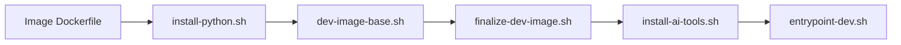

# Architecture

How **docker-dev** images and the **`cdev`** CLI fit together. Facts below are derived from the repository layout and build scripts.

## Layout

| Path | Role |
|------|------|
| `u2204dev/`, `u2404dev/`, `u2604dev/` | Ubuntu Dockerfiles + per-image `starship.toml`, `.vimrc`, themes (`u2604dev/Dockerfile:1-31`) |
| `devbox/` | Lean Debian 13 Dockerfile for sandboxed OpenCode tasks (`devbox/Dockerfile`) |
| `common/` | Shared Ubuntu install steps plus reusable Python, user, AI-tool, and entrypoint scripts (`common/`) |
| `cli/` | `cdev` launcher (`install.sh:38-43`, `cli/README.md`) |
| `scripts/` | Pre-commit pipeline (`scripts/pre-commit.sh:4-23`), validation helpers |
| `.github/workflows/build-images.yml` | Multi-profile GHCR publish for the four first-class images |

Deprecated: `u2604dev-opencode/` — local optional tag only; not in CI matrix (`u2604dev-opencode/README.md:3-4`).

## Image build pipeline

The Ubuntu images use the full shared base installer. `devbox` uses
`common/install-devbox-base.sh` for a smaller Debian package set, then reuses
the shared AI profile, user-finalization, and runtime entrypoint steps.

1. **Python** — Ubuntu images use `UBUNTU_VERSION` (`common/install-python.sh:11-33`, `u2604dev/Dockerfile:7-22`); `devbox` installs Debian's Python 3.13 packages (`common/install-devbox-base.sh`).
2. **Base** — Ubuntu images use the full apt CLI stack, Node LTS + Corepack, Oh My Zsh, Starship, vim-plug, fonts, GitHub CLI, and **Docker CLI client** (`common/dev-image-base.sh:15-78`, `common/install-docker-cli.sh:6-15`); `devbox` uses a lean Debian package set.
3. **Finalize** — optional non-root `dev` user when `DEV_CREATE_NONROOT_USER=1` (`common/setup-dev-user.sh:3-7`, `u2604dev/Dockerfile:16-25`).
4. **AI profile** — `DEV_IMAGE_PROFILE` controls global npm AI CLIs at `@latest` (`common/install-ai-tools.sh:18-44`). Every profile copies `update-ai-tools` to `/usr/local/bin`. `standard`/`ai-full` also install `asm` and bake `luongnv89/idd` + `luongnv89/skills`.
5. **Runtime** — default entrypoint (`u2604dev/Dockerfile:40-41`, `devbox/Dockerfile`).

Build context is always the **repository root** (`.`); not the per-image directory alone.

## Profiles (`DEV_IMAGE_PROFILE`)

| Profile | AI npm globals | GHCR tag suffix |
|---------|----------------|-----------------|
| `ai-full` (default) | Claude Code, Codex, OpenCode, Pi, herdr, pi-extensions, asm, idd + skills | `:latest` (`cli/lib/profiles.sh:17-24`, `.github/workflows/build-images.yml:130-132`) |
| `standard` | OpenCode, Pi, asm, idd + skills | `:latest-standard` |
| `minimal` | none | `:latest-minimal` |

CI builds all three profiles per image (`.github/workflows/build-images.yml:88-89`). Local/`cdev` defaults are `ai-full` for Ubuntu images and `standard` for `devbox` (`cli/lib/profiles.sh`, `cli/lib/build.sh`, `cli/lib/run.sh`).

## `cdev` vs plain `docker run`

- **`cdev`** resolves image name, profile tag, workspace mount, optional host config mounts, non-root uid/gid (`cli/lib/run.sh`, `cli/lib/build.sh`).
- **Install** clones or uses a checkout under `~/.local/share/docker-dev` and wraps `cli/bin/cdev` (`install.sh:8-11`, `install.sh:38-43`).
- **Docker socket** — opt-in; client in image talks to host daemon (`common/install-docker-cli.sh:2-3`, root `README.md` Docker socket section).

## CI gates

- **Change detection** — `u2204dev`, `u2404dev`, `u2604dev`, and `devbox` (`.github/workflows/build-images.yml`).
- **npm audit** — latest AI globals (`scripts/verify-ai-globals-audit.sh`, workflow job `npm-audit-ai-globals`).
- **Build** — `AI_VERIFY_MODE=strict` in CI (`.github/workflows/build-images.yml:145-146`, `CONTRIBUTING.md` verify modes).
- **Trivy / attestation** — `ai-full` pushes on `main` only (`.github/workflows/build-images.yml:156-174`).

## Related docs

- [Quick start & auth](../README.md)
- [cdev CLI](../cli/README.md)
- [Contributing](../CONTRIBUTING.md)
- [Development setup](development.md)
- [Documentation decisions](DECISIONS.md)
