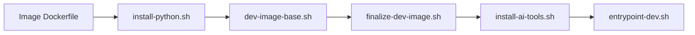

# Architecture

How **docker-dev** images and the **`cdev`** CLI fit together. Facts below are derived from the repository layout and build scripts.

## Layout

| Path | Role |
|------|------|
| `u2204dev/`, `u2404dev/`, `u2604dev/` | Thin Dockerfiles + per-image `starship.toml`, `.vimrc`, themes (`u2604dev/Dockerfile:1-31`) |
| `common/` | Shared install steps: base packages, Python, uv, gh, Docker CLI, AI tools, entrypoint (`common/dev-image-base.sh`) |
| `cli/` | `cdev` launcher (`install.sh:38-43`, `cli/README.md`) |
| `scripts/` | Pre-commit pipeline (`scripts/pre-commit.sh:4-23`), validation helpers |
| `.github/workflows/build-images.yml` | Multi-profile GHCR publish for the three `u*dev` images |

Deprecated: `u2604dev-opencode/` — local optional tag only; not in CI matrix (`u2604dev-opencode/README.md:3-4`, `.github/workflows/build-images.yml:60-72`).

## Image build pipeline

1. **Python** — version-specific via `UBUNTU_VERSION` (`common/install-python.sh:11-33`, `u2604dev/Dockerfile:7-22`).
2. **Base** — apt CLI stack, Node LTS + Corepack, Oh My Zsh, Starship, vim-plug, **Docker CLI client** (`common/dev-image-base.sh:15-78`, `common/install-docker-cli.sh:6-15`).
3. **Finalize** — optional non-root `dev` user when `DEV_CREATE_NONROOT_USER=1` (`common/setup-dev-user.sh:3-7`, `u2604dev/Dockerfile:16-25`).
4. **AI profile** — `DEV_IMAGE_PROFILE` controls global npm AI CLIs (`common/install-ai-tools.sh:3-24`, `common/install-ai-tools.sh:45-50`).
5. **Runtime** — default entrypoint (`u2604dev/Dockerfile:38-39`).

Build context is always the **repository root** (`.`); not the per-image directory alone.

## Profiles (`DEV_IMAGE_PROFILE`)

| Profile | AI npm globals | GHCR tag suffix |
|---------|----------------|-----------------|
| `ai-full` (default) | Claude Code, Codex, OpenCode, Pi, warp plugin, herdr path in ai-full branch | `:latest` (`cli/lib/profiles.sh:17-24`, `.github/workflows/build-images.yml:130-132`) |
| `standard` | OpenCode, Pi | `:latest-standard` |
| `minimal` | none | `:latest-minimal` |

CI builds all three profiles per image (`.github/workflows/build-images.yml:88-89`). Local/`cdev` defaults match `ai-full` (`cli/lib/profiles.sh:5`, `cli/lib/build.sh:52-53`).

## `cdev` vs plain `docker run`

- **`cdev`** resolves image name, profile tag, workspace mount, optional host config mounts, non-root uid/gid (`cli/lib/run.sh`, `cli/lib/build.sh`).
- **Install** clones or uses a checkout under `~/.local/share/docker-dev` and wraps `cli/bin/cdev` (`install.sh:8-11`, `install.sh:38-43`).
- **Docker socket** — opt-in; client in image talks to host daemon (`common/install-docker-cli.sh:2-3`, root `README.md` Docker socket section).

## CI gates

- **Change detection** — `u2204dev`, `u2404dev`, `u2604dev` only (`.github/workflows/build-images.yml:57-72`).
- **npm audit** — pinned AI globals (`scripts/verify-ai-globals-audit.sh`, workflow job `npm-audit-ai-globals`).
- **Build** — `AI_VERIFY_MODE=strict` in CI (`.github/workflows/build-images.yml:145-146`, `CONTRIBUTING.md` verify modes).
- **Trivy / attestation** — `ai-full` pushes on `main` only (`.github/workflows/build-images.yml:156-174`).

## Related docs

- [Quick start & auth](../README.md)
- [cdev CLI](../cli/README.md)
- [Contributing](../CONTRIBUTING.md)
- [Development setup](development.md)
- [Documentation decisions](DECISIONS.md)
