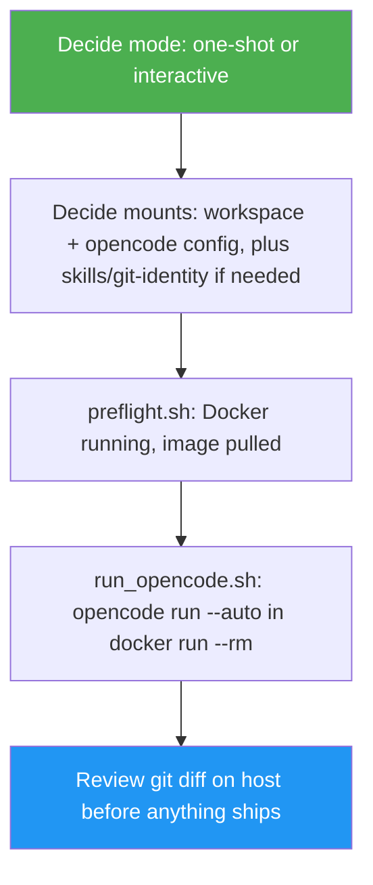

<!--
  DO NOT READ THIS FILE — This README.md is for human catalog browsing only.
  It ships inside the .skill package but is NEVER auto-loaded into agent context.
  The runtime loader only reads SKILL.md + references/ + scripts/ + agents/ when the skill triggers.
  If you're an AI agent, read the SKILL.md file instead for skill instructions.
-->

# OpenCode Docker Dev

> Run OpenCode sandboxed inside a disposable luongnv89/docker-dev container — isolated from host SSH keys and GitHub tokens by construction.

## Highlights

- One-shot mode runs `opencode run --auto` inside `docker run --rm`: a single process, a plain exit code, no TUI to drive or permission dialogs to click through
- Never mounts `~/.ssh` or injects a GitHub token — by design, not by discipline. Tasks that need push/publish access stop before that step; a human does it on the host afterward
- Handles the `~/.claude` → `~/.agents` symlink gotcha automatically when mounting Claude Code skills into the container
- Interactive mode (pairs with herdr-agent-comms or tmux-agent-comms) documents the OpenCode-specific TUI timing and permission-dialog quirks discovered while building this skill

## When to Use

| Say this...                                                        | Skill will...                                                                 |
| ------------------------------------------------------------------- | ------------------------------------------------------------------------------ |
| "Run OpenCode on this project without giving it my SSH key"        | Set up mounts, run `opencode run --auto` in a container, verify the diff      |
| "OpenCode keeps hitting rate limits, try it in a fresh container"   | Launch a fresh disposable container session against the same task            |
| "Use the docker-dev repo to run OpenCode on this repo"              | Preflight Docker, build mounts, run the task, report exit code + diff         |

## How It Works

## Usage

Model-invoked — ask to run OpenCode sandboxed, isolated from credentials, or in a fresh container to dodge rate limits, and the skill applies itself.

## Resources

| Path                                        | Description                                                                 |
| -------------------------------------------- | ----------------------------------------------------------------------------- |
| `scripts/preflight.sh`                       | Ensures Docker is running and the image is pulled                            |
| `scripts/run_opencode.sh`                    | Builds mounts and runs `opencode run --auto` in a disposable container       |
| `references/mounts-and-credentials.md`       | The credential redline, standard mounts, and the `~/.claude` symlink gotcha  |
| `references/interactive-mode.md`             | TUI readiness timing, permission dialogs, completion detection               |
| `references/troubleshooting.md`              | Provider errors, rate limits, outdated `cdev`, dependency-file leakage       |

## Output

A completed OpenCode task run against the mounted project directory, plus a
Step Completion Report showing mounts used, exit code, and whether the host
diff was reviewed before anything ships. One-shot mode's raw output is
whatever `opencode run` printed (or JSON events, with `--format json`).
